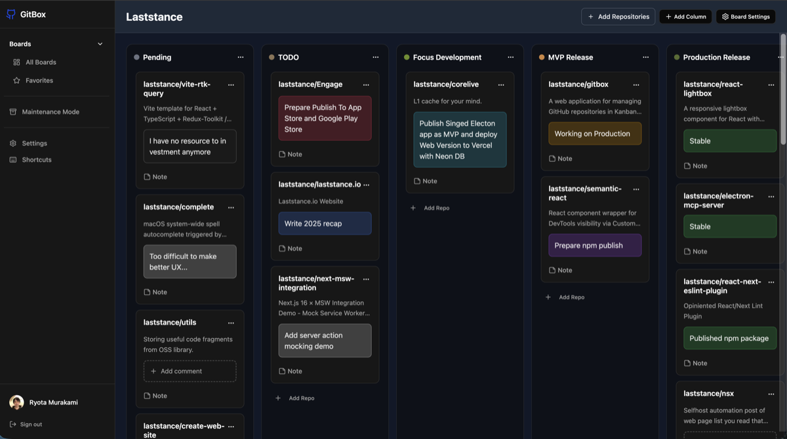

# GitBox

[](https://codecov.io/gh/laststance/gitbox)
[](https://github.com/laststance/gitbox/actions/workflows/e2e.yml)
[](https://github.com/laststance/gitbox/actions/workflows/e2e.yml)
[](https://github.com/laststance/gitbox/actions/workflows/build.yml)
[](https://github.com/laststance/gitbox/actions/workflows/test.yml)
[](https://github.com/laststance/gitbox/actions/workflows/lint.yml)

GitBox is a web app for organizing your scattered GitHub repositories in Kanban-style boards—perfect for managing the chaos of Vibe Coding projects and beyond.

- Live app: https://gitbox-laststance.vercel.app



## Why?

Because let's be honest—GitHub's repository list is kind of a mess 😅

When you have dozens (or hundreds) of repos from side projects, experiments, and Vibe Coding sessions, finding what you need becomes a treasure hunt. GitBox lets you visually organize everything in customizable Kanban boards, so you can finally bring order to the chaos.

## Features

- Kanban boards for GitHub repositories
- Drag-and-drop organization (cards, columns, boards)
- Move cards between boards
- GitHub OAuth-based access
- Supabase-backed persistence with RLS
- Rich text project notes (Plate.js editor)
- Project info links (55 built-in types + custom presets)
- Inline comments on repo cards with color customization
- Inline editable board title and subtitle
- Public board sharing with unique share links
- Maintenance mode for archived projects
- 14 themes (7 light + 7 dark) + system preference
- Collapsible sidebar with state persistence
- Command palette (⌘K)
- Rate limiting and security headers
- PWA-friendly experience

## Tech Stack

- **Framework**: Next.js 16 (App Router)
- **UI**: React 19.2, Tailwind CSS 4, shadcn/ui
- **State**: Redux Toolkit + @laststance/redux-storage-middleware
- **Database**: Supabase (PostgreSQL + Auth + RLS)
- **Rich Text**: Plate.js (Platejs 52)
- **Drag & Drop**: @dnd-kit
- **Validation**: Zod 4
- **Monitoring**: Sentry 10
- **Testing**: Playwright (E2E), Vitest (Unit), Storybook 10

## Getting Started

### Prerequisites

- Node.js >=24.12.0
- pnpm 10.26.2

### Setup

```bash
pnpm install
cp .env.local.example .env
```

Fill in the values in `.env` with your configuration.

### Environment Variables

| Variable                        | Required | Description                                            |
| ------------------------------- | -------- | ------------------------------------------------------ |
| `NEXT_PUBLIC_SUPABASE_URL`      | ✅       | Supabase project URL                                   |
| `NEXT_PUBLIC_SUPABASE_ANON_KEY` | ✅       | Supabase anonymous key                                 |
| `SUPABASE_SERVICE_ROLE_KEY`     | ✅       | Supabase service role key (server-only)                |
| `GITHUB_CLIENT_ID`              | ✅       | GitHub OAuth App client ID                             |
| `GITHUB_CLIENT_SECRET`          | ✅       | GitHub OAuth App client secret                         |
| `NEXT_PUBLIC_SITE_URL`          | ✅       | Site URL for OAuth callbacks                           |
| `SENTRY_AUTH_TOKEN`             | ❌       | Sentry authentication token (optional)                 |
| `APP_ENV`                       | ❌       | Environment mode (`development`, `test`, `production`) |
| `NEXT_PUBLIC_ENABLE_MSW_MOCK`   | ❌       | Enable MSW mocking for tests                           |

**Vercel Environment Variables:**

When deploying to Vercel, the following are auto-injected:

- `VERCEL_ENV` - Current deployment environment
- `VERCEL_URL` - Deployment URL

### Local Supabase Setup

**Prerequisites:** Docker Desktop running

```bash
# Start local Supabase (sources OAuth env vars + applies migrations)
pnpm db:start

# Check status and credentials
supabase status

# Stop when done
pnpm db:stop

# Reset database (re-apply all migrations)
pnpm db:reset
```

**Local URLs:**

- Studio: http://127.0.0.1:54323
- API: http://127.0.0.1:54321

### GitHub OAuth for Local Development

Supabase CLI reads OAuth credentials from `supabase/.env` (not root `.env`).

1. Create `supabase/.env`:

```bash
GITHUB_CLIENT_ID="your-github-oauth-client-id"
GITHUB_CLIENT_SECRET="your-github-oauth-client-secret"
```

2. Configure GitHub OAuth App with callback URL: `http://127.0.0.1:54321/auth/v1/callback`

3. Restart Supabase after adding/changing `.env`:

```bash
supabase stop && supabase start
```

### Start Development Server

```bash
pnpm dev
```

Open `http://localhost:3008` in your browser.

## Scripts

- `pnpm dev` - Start dev server (port 3008)
- `pnpm build` - Production build
- `pnpm start` - Start production server (port 3008)
- `pnpm lint` - ESLint (zero warnings)
- `pnpm typecheck` - TypeScript type check
- `pnpm test` - Unit tests (Vitest)
- `pnpm e2e` - E2E tests (Playwright, sequential)
- `pnpm e2e:parallel` - E2E tests (parallel shards, recommended)
- `pnpm storybook` - Storybook dev server (port 6006)
- `pnpm db:start` - Start local Supabase (Docker)
- `pnpm db:stop` - Stop local Supabase
- `pnpm db:reset` - Reset local database

## Security

See `SECURITY.md`.

## License

MIT. See `LICENSE`.
