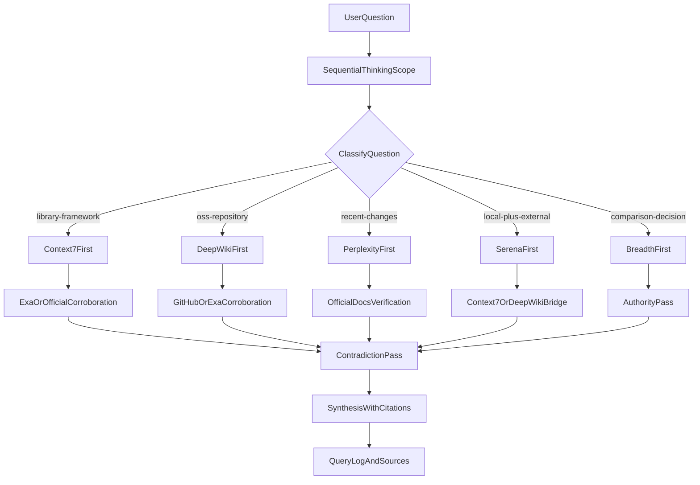

# Research Command v2

## Purpose

`/research` should produce source-grounded, reviewable briefs by selecting the
best evidence path for the question type instead of forcing every query through
the same tool order.

This specification redesigns the command around:

- question classification before retrieval
- role-based tool routing
- a dedicated DeepWiki branch for open-source repository research
- explicit fact vs inference separation
- stronger contradiction handling and auditability

## Current Gaps To Fix

The current command is strong, but it has a few recurring issues:

1. It starts from a mostly fixed linear flow even when the question clearly
   points to a better first source.
2. It treats Perplexity as the default starting point for many questions where
   Context7 or DeepWiki would be more authoritative.
3. It has no first-class branch for open-source repository investigation, which
   leads to over-reliance on broad web search and under-use of repository-aware
   documentation.
4. It verifies claims, but it does not force a clean separation between facts,
   inferences, and unresolved contradictions in the final report.
5. It handles tool failures, but the fallback model is framed around tool names
   instead of evidence quality.

## Design Goals

- minimize unnecessary search hops
- prefer the highest-authority starting point for each question type
- improve reproducibility with stronger citations and query logs
- add a DeepWiki-first path for OSS repository questions
- preserve the command's research-only, no-edit behavior

## Question Classifier

Before broad discovery, classify the request into one primary lane.

| Lane                  | Typical Questions                                                        | Primary Start         | Secondary Support    | Final Verification                 |
| --------------------- | ------------------------------------------------------------------------ | --------------------- | -------------------- | ---------------------------------- |
| `library-framework`   | API usage, behavior, best practices, upgrade guidance                    | Context7              | Exa code context     | Perplexity or official docs        |
| `oss-repository`      | repo structure, design intent, feature location, implementation overview | DeepWiki              | Exa or GitHub pages  | Perplexity or primary repo docs    |
| `recent-changes`      | release changes, recent announcements, ecosystem shifts                  | Perplexity Search/Ask | Exa breadth scan     | official release notes/docs        |
| `local-plus-external` | how local code relates to framework or OSS behavior                      | Serena                | Context7 or DeepWiki | Perplexity if comparison is needed |
| `comparison-decision` | compare tools, trade-offs, recommendations                               | breadth search        | authority pass       | contradiction pass                 |

If a query spans multiple lanes, choose the dominant lane first and then add one
cross-check lane only when needed.

## Workflow



## Tool Role Matrix

### `user-sequential-thinking`

Use for:

- restating the question
- identifying the main lane
- defining acceptance criteria
- recording assumptions and gaps

Do not use for:

- factual retrieval
- citations

### `user-context7`

Use for:

- official library and framework documentation
- version-sensitive API or behavior questions
- authoritative usage guidance

Do not use for:

- recent news
- repository architecture unless the library docs already cover it

### `user-exa`

Use for:

- breadth discovery
- URL gathering
- code/documentation context around APIs and implementations

Do not use for:

- final authority by itself when an official source is available

### `user-perplexity`

Use for:

- recent changes
- fast web-grounded synthesis
- contradiction checks
- trade-off analysis across multiple sources

Do not use for:

- sole authority when official docs or repo-specific docs are available

### `user-serena`

Use for:

- local repository evidence
- symbol-level confirmation
- matching local implementation to external claims

Do not use for:

- general web research

### `user-deepwiki`

Use for:

- repository topic mapping
- repo-level architecture understanding
- locating documented areas of an open-source repository
- natural-language Q&A grounded in repository documentation

Do not use for:

- latest ecosystem news
- exact API guarantees when official versioned docs are available elsewhere

## DeepWiki Branch

Use the DeepWiki lane when the user is asking about a public repository as a
system rather than a single API call.

### Entry Criteria

Prefer DeepWiki first when the user asks:

- how a repository is structured
- where a feature is implemented or documented
- what the architecture or design intent is
- how a repo compares to another repo at a high level

### DeepWiki Sequence

1. `read_wiki_structure`
   - build the topic map first
   - identify 2-4 likely documentation sections
2. `read_wiki_contents`
   - pull the main repository documentation body
   - extract the sections that answer the question
3. `ask_question`
   - ask a focused repo-specific question only after the structure is known
4. corroborate with one external source
   - GitHub README, release notes, docs site, Exa, or Perplexity

### DeepWiki Verification Rule

Treat DeepWiki as a high-value repository explainer, not an unquestionable final
source. For any major claim about current behavior, releases, guarantees, or
policy, corroborate with at least one of:

- official documentation site
- GitHub README or docs pages
- release notes or changelog
- a second independent retrieval source

## Output Contract

Every `/research` response should use this structure.

### 1. Executive Summary

- 5-10 short bullets
- answer first
- include only the highest-value findings

### 2. Evidence Map

- group evidence by `primary`, `supporting`, and `counter`
- show why each source matters

### 3. What We Know

- facts only
- every major claim cited inline with a direct URL

### 4. What We Infer

- interpretation built from the evidence
- clearly separated from facts

### 5. Contradictions And Unknowns

- preserve unresolved disagreements
- call out missing primary sources
- state any ambiguity explicitly

### 6. Confidence

- `high`: multiple primary sources align
- `medium`: primary source exists but support is thin or partly indirect
- `low`: evidence is weak, conflicting, or mostly secondary

### 7. Actionable Next Steps

- follow-up queries
- validation actions
- suggested domains or repos to inspect

### 8. Query Log

| Tool | Query/Prompt | Filters | Why Used | Outcome |
| ---- | ------------ | ------- | -------- | ------- |

### 9. Sources

- list every cited URL once at the end
- include publisher and date when known

## Citation Rules

- every material factual claim must have an inline citation
- use direct URLs only
- prefer primary sources over summaries
- if only secondary evidence exists, say so explicitly
- do not present model synthesis as if it were a source

## Evidence Quality Rules

Rank sources in this order when available:

1. official documentation, specifications, release notes
2. repository-owned documentation or README content
3. code host artifacts such as issues, discussions, and PRs
4. community explanations
5. AI-generated synthesis

If a lower-tier source is used because a higher-tier source is unavailable, note
that limitation in the report.

## Failure And Fallback Strategy

Fallbacks should be based on evidence quality, not just tool substitution.

### `tool unavailable`

- switch to another tool that serves the same role
- note the missing tool once in the query log
- do not claim that a source class was checked if it was not

### `thin evidence`

- stop short of a firm recommendation
- say `insufficient evidence`
- provide exact follow-up queries or target domains

### `conflicting evidence`

- keep both positions
- label one as `counter` if it challenges the main claim
- prefer the newer and more authoritative source, but still preserve the conflict

### `no primary source`

- downgrade the claim to `supporting`
- add a limitation note
- reduce confidence

### `stale evidence`

- if the topic is fast-moving, explicitly check for recent updates
- if newer evidence is unavailable, state the date boundary of the research

## Recommended Default Paths

### Library Question

1. Sequential Thinking scope
2. Context7 library resolution
3. Context7 docs query
4. Exa code context for examples
5. Perplexity contradiction check if behavior is disputed

### OSS Repository Question

1. Sequential Thinking scope
2. DeepWiki structure
3. DeepWiki contents or Q&A
4. GitHub or Exa corroboration
5. Perplexity only if comparison or recent changes matter

### Recent Ecosystem Question

1. Sequential Thinking scope
2. Perplexity Search
3. Perplexity Ask or Reason
4. Exa breadth scan
5. official doc or release note verification

### Local Code Plus External Docs

1. Sequential Thinking scope
2. Serena local evidence
3. Context7 or DeepWiki based on target
4. Perplexity only for contradiction or recent policy changes

## Drop-In Command Draft

The section below is a replacement draft for the slash command itself.

```md
# Research Agent Command (`/research`)

## Mission

`/research` is a source-grounded investigation command that produces auditable
briefs. It never edits code. It discovers, validates, contrasts, and
synthesizes evidence.

## Non-Negotiable Rules

1. No code edits. Code snippets are evidence only.
2. Always cite direct URLs with publisher and date when known.
3. Separate facts from inference in the final write-up.
4. Log all tool calls in a query log.
5. If evidence is weak, conflicting, or inaccessible, state the limitation.
6. Classify the question before retrieval and start from the highest-authority
   lane for that question type.

## Research Lanes

### `library-framework`

- Start with `Context7`
- Add `Exa` for code context
- Use `Perplexity` only for contradiction checks or recent change checks

### `oss-repository`

- Start with `DeepWiki`
- Use `read_wiki_structure` before `read_wiki_contents` or `ask_question`
- Corroborate with GitHub or another independent source before final claims

### `recent-changes`

- Start with `Perplexity Search`
- Use `Perplexity Ask/Reason` for synthesis
- Verify with official release notes or docs

### `local-plus-external`

- Start with `Serena`
- Bridge to `Context7` or `DeepWiki` depending on whether the target is a
  framework or an OSS repository

### `comparison-decision`

- Start with breadth discovery
- do an authority pass
- do a contradiction pass
- synthesize only after conflicting evidence has been checked

## Standard Workflow

### Phase 1: Scope And Classify

- Restate the user question
- Break into sub-questions
- Define acceptance criteria
- Classify the question into one primary lane

### Phase 2: Lane-Specific Retrieval

- Use the lane's primary tool first
- Pull only the minimum extra tools needed for corroboration

### Phase 3: Authority Pass

- Confirm major claims with the strongest available source class

### Phase 4: Contradiction Pass

- Search for counter-evidence and recent changes

### Phase 5: Synthesis

Produce:

1. Executive Summary
2. Evidence Map
3. What We Know
4. What We Infer
5. Contradictions And Unknowns
6. Confidence
7. Actionable Next Steps
8. Query Log
9. Sources

## Failure Handling

- If a tool is unavailable, switch to another tool with the same role
- If evidence is thin, say `insufficient evidence`
- If there is no primary source, lower confidence and say so
- If evidence conflicts, preserve both sides with citations
```

## Implementation Notes

- This spec is intentionally tool-role driven so that future additions such as
  Brave Search can be slotted in as another breadth-discovery source without
  rewriting the whole workflow.
- This spec leaves room for future lane-specific add-ons such as a dedicated
  package registry lane or standards/specification lane.
